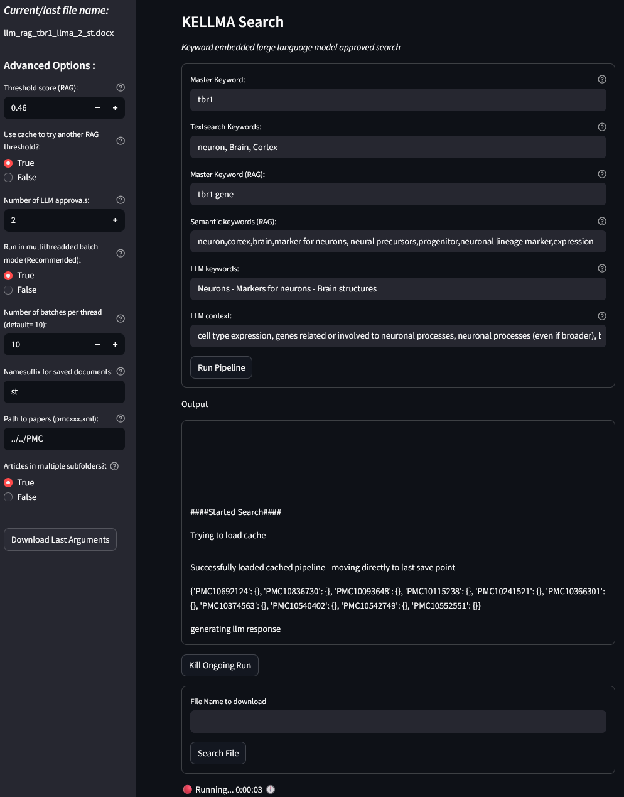
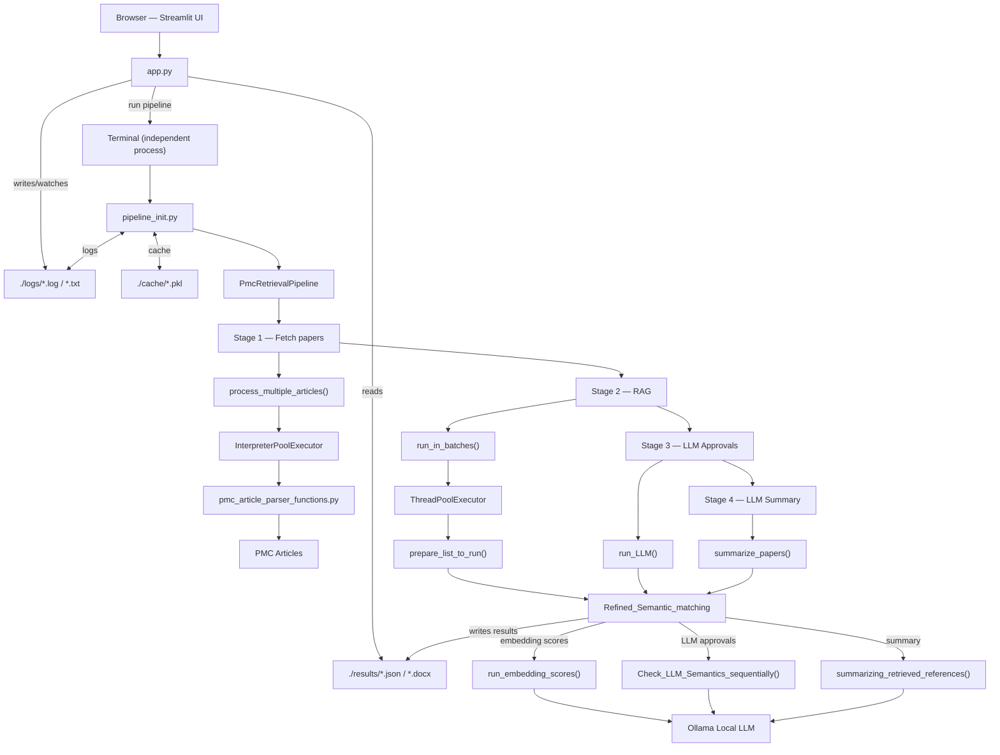

# 🧿 KELLMA Search


*Keyword Embeddings Large Language Model Approved Search*

---

KELLMA Search is a full‑stack Python application designed to streamline exploration of **PubMed Central (PMC)** biomedical literature. It combines a Streamlit interface, with a modular, multi‑stage backend pipeline, local LLM inference through Ollama, and parallelized execution. The system generates persistent DOCX/JSON reports with direct quotes extracted from the most relevant articles.

## Table of Contents
- [Why KELLMA?](#-why-kellma)
- [Key Features](#-key-features)
- [How KELLMA differs from typical RAG tools](#-how-kellma-differs-from-typical-rag-tools)
- [User Interface](#-user-interface)
- [High-Level Architecture](#-high-level-architecture)
- [Dependencies](#-dependencies)
- [Installation](#-installation)
- [System Requirements](#-system-requirements)
- [FAQ](#-faq)
- [Contributing](#-contributing)
- [License](#-license)


## 🎯 Why KELLMA?
  Biomedical literature is growing at an overwhelming pace. Traditional keyword search misses nuance, and most cloud‑based LLM systems are optimized for speed and cost. As a result, they tend to summarize broad concepts rather than produce grounded, reference‑level outputs. Running deep semantic filtering across **millions** of full‑text articles is computationally intensive and simply not feasible for many users in a hosted LLM environment. KELLMA bridges that gap by combining parallelized parsing, local embeddings, and multi‑LLM validation to surface only the most relevant PMC content — fast, reproducibly, and fully offline. The result is a modular, high‑precision system for biomedical literature scanning, semantic filtering, and automated summarization when contextual accuracy and explicit referencing truly matter.

## ✨ Key Features

- **High‑precision retrieval** across millions of PMC full‑text articles
- **Semantic matching** using Ollama embeddings for semantic scoring
- **Multi‑LLM validation** to approve or reject retrieved chunks based on contextual accuracy
- **LLM‑based summarization** of the final, approved references
- **Concurrent execution** through Python’s `concurrent.futures` for scalable parallelism and high throughput
- **Modular, multi‑stage pipeline** with clear boundaries for retrieval, RAG, validation, and summarization
- **Structured JSON/DOCX outputs** for clean, ready‑to‑use reports
- **Persistent logs** for reproducibility, traceability, and debugging
- **Cache layer** for fast restarts.
- **User‑friendly Streamlit interface** for launching searches, monitoring progress, and downloading results


## 🆚 How KELLMA differs from typical RAG tools
| Feature | Standard RAG/LLM | KELLMA |
|--------|---------------|--------|
| Designed for millions of PMC articles | ❌ **No** | ✅ **Yes** |
| Multi‑LLM semantic approval | ❌ **No** | ✅ **Yes**|
| Exact citation retrieval | ❌ **No** | ✅ **Yes**|
| Grounded summaries of retrieved articles | ❌ **No** | ✅ **Yes**|
| Works fully offline |  ⚠️ **Partial** | ✅ **Yes**|
| Persistent logs, cache, and Word/JSON report generation | ⚠️ **Partial** | ✅ **Yes**|

## 🌐 User Interface
<details><summary></span></summary>


</details>

---
## <span id="high-level-architecture">📐 High-Level Architecture</span>

KELLMA Search is designed to handle large volumes of biomedical literature efficiently. The system uses a Streamlit front end that launches a fully independent Python process in the background. This backend is modular, scalable, and organized into clear stage boundaries to support maintainability and future expansion.

The Search itself is performed by following a 4 step protocol: 
1. PMC article parsing, text chunking, and keyword retrieval
2. Embedding‑based semantic matching to identify relevant text chunks
3. Literature review by four different LLM models to validate the semantic accuracy of retrieved text
4. Summarization and final report generation using only the approved chunks and references

<br>

### 🗺️ Flowchart Architecture Overview
<details>
 <summary></summary>


</details>

### 💠 ASCII Architecture Overview
<details>
 <summary></summary>

```text
Browser (Streamlit UI)
  ↓
app.py
  ├─ UI
  ├─ writes/watches states ←→ ./logs/ (*.log / *.txt)
  ├─ reads results ← ./results/ (*.json / *.docx)
  └─ run pipeline button
     ↓
-----------------------------------------------------
 Terminal (independent process)
  └─pipeline_init.py
     ├─ watches/writes ←→ ./logs/ (*.log / *.txt)
     ├─ reads/writes cache ←→ ./cache/ (*.pkl)
     └─ class_pmc_retrieval.py
         └─ class PmcRetrievalPipeline    
             ├─ Stage 1 — Fetch papers   
             │       └─ process_multiple_articles()
             │           └─ InterpreterPoolExecutor (true multithreading)
             │               └─ pmc_article_parser_functions.py
             │                   ├─ reads PMC articles
             │                   ├─ keyword search
             │                   └─ text chunking   
             │
             ├─ Stage 2 — RAG
             │      └─ run_in_batches()
             │             └─ ThreadPoolExecutor (parallel calls)
             │                 └─ prepare_list_to_run()
             │                    └─ rag_class.py
             │                       └─ class Refined_Semantic_matching
             │                           └─ run_embedding_scores()
             │                               └─ calls Ollama for embeddings
             ├─ Stage 3 — LLM Approvals 
             │      └─ run_LLM()
             │             └─ rag_class.py
             │                 └─ class Refined_Semantic_matching
             │                    └─ Check_LLM_Semantics_sequentially()
             │                       └─ calls Ollama for LLM approvals
             │                           
             ├─ Stage 4 — LLM Summary 
                 └─ summarize_papers()
                     ├─ rag_class.py
                     │   └─ class Refined_Semantic_matching
                     │       └─ summarizing_retrieved_references()
                     │           └─ calls Ollama for LLM summary (limit: 100 chunks)
                     └─ writes final outputs → ./results/ (*.json / *.docx)             
```
</details>

### 📁 Project Structure
<details>
 <summary></summary>

```text
.
├── LICENSE
├── README.md
├── PMC/
│    └── *.xml                                  # Articles as .xml files (Unicode)
├── src/
│    ├── app.py                                 # Streamlit UI
│    └── backend
│         ├── pipeline_init.py                  # Entry point for backend pipeline
│         ├── class_pmc_retrieval.py            # PmcRetrievalPipeline class
│         ├── rag_class.py                      # Refined_Semantic_matching class
│         └── pmc_article_parser_functions.py   # Functions for parsing and scanning PMC articles
├── cache/                                      # .pkl caches
│    └── *.pkl
├── logs/                                       # Log files for debugging
     ├──*.txt
     └──*.log                                   
└── results/                                    # Final JSON / DOCX outputs
     ├──*.docx
     └──*.json

```
</details>

---
## 📦 Dependencies

| Component | tested version |
|-----------|-----------------|
| Ollama | 0.13.50-0.15.1
| Python | 3.14.1 |
| pip | 25.3 |
| streamlit | 1.52.2 |
| numpy | 2.3.5 |
| scikit-learn | 1.7.2 |
| python-docx | 1.2.0 |

## 📎 Installation

### 1. Clone the repository 
```bash 
git clone https://github.com/daniel-sampaio-goncalves/KELLMA.git 
cd KELLMA
```

### 2. Install dependencies
```bash
pip install -r requirements.txt
```
### 3. Install and configure Ollama
Download Ollama at <https://ollama.com/download>

> **Note:**<br>
For more info on Ollama check out their [documentation](https://docs.ollama.com/)

Once Ollama installed, download the required LLM models using the following commands in your terminal:
```bash
ollama  pull  qwen3-embedding:latest
ollama  pull  gpt-oss:20b
ollama  pull  qwen3:32b
ollama  pull  gemma3:27b
ollama  pull  deepseek-r1:32b
```
Set some a optional flag before running ollama:
```ps1
# increase the request queue size for high‑concurrency workloads
$env:OLLAMA_MAX_QUEUE= "4096" 
# launch ollama
ollama serve
```
### 4. Download and extract PMC articles
For licensing reasons, PMC files will not be shared on GitHub. A free, open text‑mining dataset is available directly from [PubMed](https://pmc.ncbi.nlm.nih.gov/tools/textmining/) through public servers. Follow their instructions to download and extract the data. The current version was tested on curated `PMC*.xml` files containing Unicode characters. Articles can be placed in a single folder (`PMC/*.xml`) or organized across multiple subfolders (e.g., `PMC/FOLDER_1/*.xml`, `PMC/FOLDER_2/*.xml`, `PMC/FOLDER_.../*.xml`).

>**Note:**<br>
>While NTFS does not impose a strict limit on the number of files in a single directory, Windows performance can degrade significantly when a folder contains very large numbers of files. Antivirus scanning, file indexing, Explorer enumeration, and backup tools may slow down or interrupt file operations. For better reliability and performance, it’s recommended to split large collections of articles into multiple folders, each containing fewer than one million files.


### 5. Run the Streamlit UI
Run the command below in a terminal using an environment that defaults to Python 3.14.1+. Once executed, your browser should open at <http://localhost:8501/>
```bash
cd src
streamlit run app.py --server.port=8501
```
>**Important:**<br>
>Using Python versions earlier than 3.14 will result in errors, because the backend relies on `InterpreterPoolExecutor` for multiprocessing which is a feature introduced in Python 3.14.

## ⚡ System Requirements
|Component | Recommended |
|-----------|-----------------|
| OS | Windows 11 64-bit|
| CPU | x64 multicore CPU|
| GPU | Nvidia RTX3090 or better |
| VRAM | > 20GB |
| RAM | > 32GB |
| Storage | NVME SSD with > 1GB/s read/writes|
| Filesystem | NTFS |


>**Notes:** <br><br>
>**Regarding multi‑GPU support:**<br>
The application was built to run locally on a single workstation, but the code structure was intentionally designed to allow future support for multiple GPUs and multiple Ollama server instances for RAG and LLM approval steps. This is not implemented yet, but it may become a feature later on.<br><br>
**Regarding queue support:**<br>
The app is currently designed to handle only one request at a time to avoid overhead on smaller workstations. However, a queue system could be added in future versions for users running on faster/server hardware.<br><br>
**Regarding testing:**<br>
Currently, the application has only been tested on a single Windows 11 machine. The workload is computationally intensive, so a powerful and stable system is recommended for optimal performance.<br>
On the test system used (Intel i9-10900K CPU, Nvidia RTX 3090 GPU, 128GB DDR4 RAM, 2 TB NVMe SSD, NTFS), processing peaked at approximately 1.6GB/s, with CPU utilization near 90% on all cores during article parsing while RAM stayed below 64GB. GPU utilization was consistently staying between 90–100% during inference. For a given query, workload duration may vary a lot depending on how many articles are found, and depends on how many text chunks are passed through each step, with later steps being more time demanding.


## ❔ FAQ

| Question | Answer |
|---------|--------|
| Do I need a GPU with a lot of VRAM to run this? | No. Although this pipeline hasn’t been fully tested on CPU‑only setups, Ollama can run models on CPU if you have enough RAM at a significant performance cost. Any GPU supported by Ollama will in theory work and will automatically split the load between GPU and CPU when VRAM is limited. |
| I don't have any results / The pipeline ended with “No articles found matching the keyword search” | This simply means no articles matched your query. Either the keyword doesn’t appear in the dataset, or your XML format isn’t being parsed correctly. Check the error logs for more details. |
| It's taking forever | LLM inference is slow, and GPU performance varies widely. You can reduce runtime by choosing a *rare* master keyword instead of a common one. With very large datasets, always pre‑filter aggressively using keyword searches as later stages (RAG/LLM inference) are far more expensive. The algorithm looks for the master keyword **plus at least one additional keyword**, so selecting a rare master keyword dramatically reduces the search space. For example, when looking for *Sox13* expression in muscle, avoid using *muscle* as the master keyword. Instead, use *sox13* as the master keyword and *muscle*,*expression* as secondary keywords, since far fewer articles mention *Sox13*.|

## 🤝 Contributing
*KELLMA* is an open‑source project I whipped up during some downtime to help myself and my lab colleagues screen through literature more efficiently. It’s not my full‑time job, so feel free to fork the repository, modify the app, and experiment with it.

|Next Milestones|
|-----------|
| Redesign embedding requests to Ollama for faster throughput |
| Add multi‑GPU / multi‑instance Ollama support |
| Improve file‑loading performance |
| Implement sequential job queueing |
| Expand parsing filters (author, date, journal, etc.) |
| Support bioRxiv text files |

## 📜 License
Apache 2.0 – see the [LICENSE](LICENSE) file for details.

---